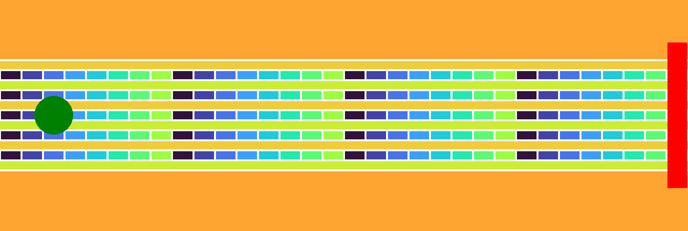

# pigsim
Supporting scripts for the design and layout of planar ion guides. Combined with the enclosed jupyter notebooks and lua scripts, the code in this repository allows users to interactively develop planar ion guides (e.g. [Structures for Lossless Ion Manipulations](https://en.wikipedia.org/wiki/Structures_for_lossless_ion_manipulations)) and output the necessary SIMION files for their simulation. 
A brief tutorial is shown in the enclosed pdf file. 

To ease the transition from developing an ion guide concept, simulation, and its physical implementation of a circuit board, these scripts can also be linked with [SLIM-Pickins](https://github.com/bhclowers/SLIM-Pickins) to translate the simulated designs directly into KiCad. 

The python generated image below is taken directly from the jupyter notebook that allows the user define the starting position and splat points for the SIMION simulation.

These research products were developed with the support of the [NIGMS](https://www.nigms.nih.gov/) R01-GM140129

